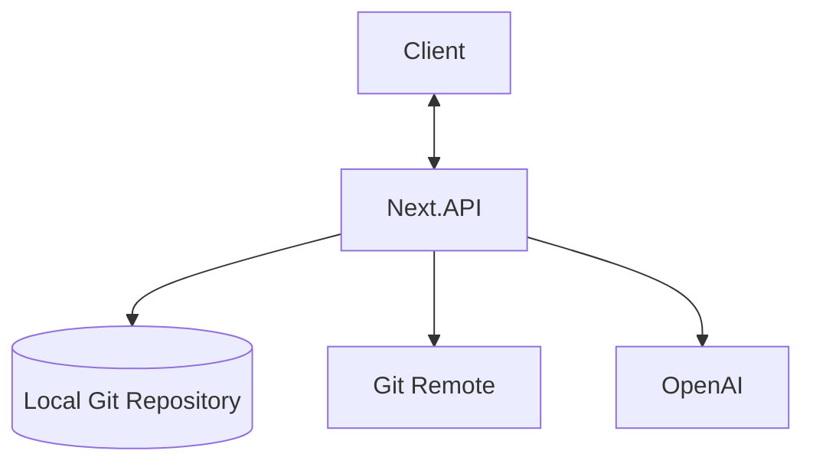
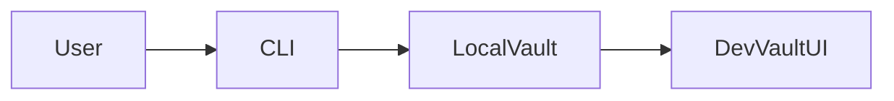
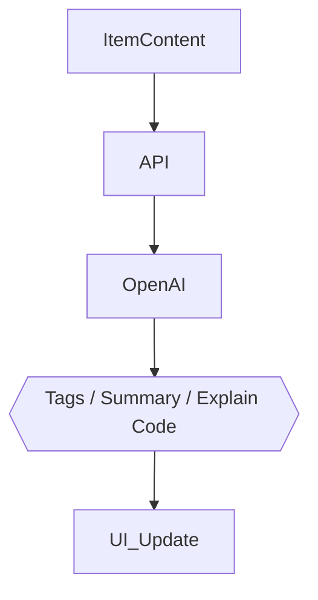

## DevVault Project Specifications

🚀 Git-Native Developer Knowledge Hub

---

## DevVault Project Specifications

🚀 **Git-native Developer Knowledge Hub** for code snippets, AI prompts, notes, commands, links, files & images.

---

## 📌 Problem (Core Idea)

Developers keep their essentials scattered:

- Code snippets in VS Code or Notion
- AI prompts in chats
- Context files buried in projects
- Useful links in bookmarks
- Docs in random folders
- Commands in .txt files
- Images and files in random directories
- Personal knowledge across multiple computers

This creates **context switching, lost knowledge** and **inconsistent workflows**.

➡️ **DevVault provides ONE searchable developer knowledge hub backed by a Git repository, keeping the user's data portable, versioned and synchronized.**

---

## 🧑‍💻 Users

| Persona                    | Needs                                     |
| -------------------------- | ----------------------------------------- |
| Everyday Developer         | Quick access to snippets, commands, links |
| AI‑First Developer         | Store prompts, workflows, contexts        |
| Content Creator / Educator | Save course notes, reusable code          |
| Full‑Stack Builder         | Patterns, boilerplates, API references    |

---

## ✨ Core Features

### A) Items & System Item Types

Items can belong to one of the following built‑in types:

- Snippet
- Prompt
- Note
- Command
- File
- Image
- URL

Items are stored as files in the user's Git repository.

### B) Collections

Organize items—mixed item types allowed.

Examples:

- React Patterns
- Context Files
- Python Snippets

Collections are represented through repository structure and/or metadata rather than a centralized database.

### C) Search

Full‑text search across:

- Content
- Tags
- Titles
- Types

Search operates on the local Git repository.

### D) Git Synchronization

- Git repository is the source of truth
- Local-first storage
- Commit changes from DevVault
- Pull and push changes
- Access the same vault from multiple computers
- GitHub / GitLab / other Git remotes can be used for synchronization

### E) Additional Features

- Favorites & pinned items
- Recently used
- Import from files
- Markdown editor for text items
- File and image attachments
- Export through the Git repository itself
- Dark mode (default)
- CLI tool for setup and application management

### F) AI Superpowers

- Auto-tagging
- AI summaries
- Explain Code
- Prompt optimization

> AI powered by **OpenAI gpt-5-nano**

---

## 🗄️ Data Model (Git-Based Draft)

> DevVault does not require Prisma or a traditional database. The Git repository is the source of truth and stores notes, metadata, files and images.

A typical vault may look like:

```text
my-devvault/
├── .devvault/
│   └── config.json
├── notes/
│   ├── docker-networking.md
│   └── mongodb-indexes.md
├── prompts/
│   └── code-review.md
├── snippets/
│   ├── python/
│   └── typescript/
├── links/
├── images/
└── files/
```

Text-based items can use Markdown with frontmatter:

```yaml
---
id: abc123
title: Docker Networking
type: note
tags:
  - docker
  - networking
createdAt: 2026-08-01T12:00:00Z
updatedAt: 2026-08-01T12:00:00Z
---
```

No `User`, `Item`, `Tag`, or `Collection` database models are required for the local-first MVP.

---

## 🧱 Tech Stack

| Category    | Choice                                       |
| ----------- | -------------------------------------------- |
| Framework   | **Next.js (React 19)**                       |
| Language    | TypeScript                                   |
| Database    | **None — Git repository as source of truth** |
| Data Format | Markdown + YAML frontmatter                  |
| Git         | isomorphic-git / Git                         |
| CLI         | Node.js + Commander.js                       |
| Search      | MiniSearch / FlexSearch                      |
| CSS/UI      | Tailwind CSS v4 + ShadCN                     |
| Editor      | Markdown editor / Tiptap                     |
| Code Editor | Monaco Editor                                |
| AI          | OpenAI gpt-5-nano                            |
| Deployment  | Local application                            |
| Monitoring  | Sentry (later, optional)                     |

---

## 🎨 UI / UX

- Dark mode first
- Minimal, developer‑friendly UI
- Syntax highlighting for code
- Inspired by **Notion, Linear, Raycast**

### Layout

- **Collapsible sidebar** with filters & collections
- Main grid/list workspace
- Full‑screen item editor
- Git synchronization status
- Search / command palette

### Responsive

- Mobile drawer for sidebar
- Touch‑optimized icons and buttons

---

## 🔌 API Architecture



The Next.js application reads and writes directly to the configured local vault.

Git operations handle:

- Add / update / delete files
- Commit changes
- Pull changes
- Push changes
- Detect synchronization conflicts

---

## 🔐 Auth Flow



Authentication is **not required for the local-first MVP**.

The user owns and controls the Git repository. Access to private remote repositories is handled by the user's existing Git authentication mechanism (SSH keys, credential manager, or provider authentication).

Future hosted/team features may introduce application-level authentication.

---

## 🧠 AI Feature Flow



---

## 🧭 Roadmap

### **MVP**

- CLI installation
- `devvault init`
- `devvault start`
- Items CRUD
- Git-backed storage
- Collections
- Search
- Basic tags
- Markdown editor
- Local Git commits

### **Pro Phase**

- GitHub / GitLab synchronization
- AI features
- File and image attachments
- Favorites & pinned items
- Advanced search
- Import / export

### **Future Enhancements**

- Git conflict resolution UI
- VS Code extension
- Browser extension
- API + remote CLI

---

## 📌 Status

- In planning
- Ready for environment setup & UI scaffolding

---

🏗️ **DevVault — Your developer knowledge, versioned.**
